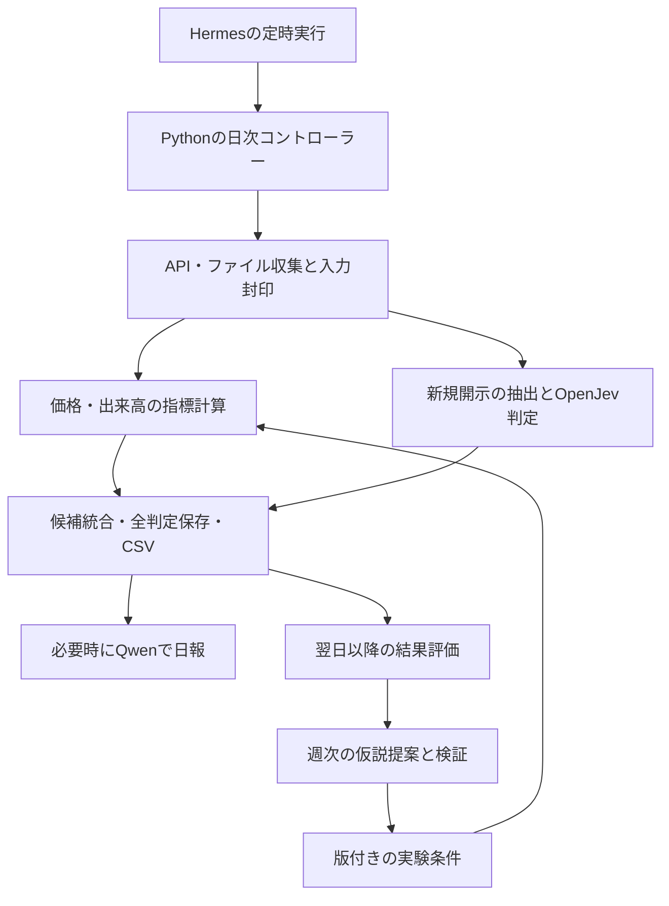

# システム設計

版: 0.1 / 2026-09-27 / Python独立実行を中心にした単一利用者向け構成

## 1. 分担と流れ



図の２経路は論理上の分離。GPU推論を同時に実行する指示ではない。OpenJev終了・GPU解放後にQwenを使う。[ローカル実行設計](05_local_runtime.md)を優先する。

## 2. 実装する構成

| 層 | 責務 |
|---|---|
| CLI / controller | 実行ID、排他ロック、段階管理、開始・終了・再開 |
| providers | 市場データ、カレンダー、開示を共通型へ変換。APIとファイルを交換可能にする |
| snapshots | 生データ・版・時点を封印。取得後の訂正を別版として保存 |
| features / screening | 数値指標と固定ルール。ネットワーク・LLMに依存しない関数 |
| semantic | 資料の限定、OpenJev呼出し、応答検証、キャッシュ、判定不能管理 |
| reports | CSV、run_manifest.json、読みやすい実行報告の生成 |
| evaluation | 将来結果の集計。抽出側から結果ラベルを参照できない構成 |
| research | 仮説台帳、比較実験、版の昇格履歴 |
| runtime | モデルの起動・停止・健康確認とGPU占有管理 |

初期の技術案はPython 3.11以上の独立環境、型付きデータ境界、SQLiteのメタデータ台帳、Parquetの数値履歴、元資料ファイルの保存。GPUサーバー・Hermesはそれぞれ別環境とし、Python依存関係の競合を避ける。最終対応バージョンは実装時に固定する。最初からWebサーバーやメッセージキューを導入しない。

実装予定の配置:

```text
src/alpha_loop/       # providers, snapshots, features, screening, semantic等
configs/             # 条件、質問、モデル参照、試験用設定
tests/fixtures/      # 合成データ。実データに見せない
data/raw/            # 取得元の原本とhash
data/snapshots/      # 封印した入力manifestと正規化データ
data/state.sqlite    # 実行・仮説・開示・AI応答の参照台帳
outputs/<run_id>/    # CSV、manifest、日報
integrations/hermes/ # 起動用ラッパーとSkillの配布元
```

上記は設計であり、この時点では実装・データは作成していない。秘密情報とdata/outputsの実データはGit対象外にする。公開可能な合成fixtureのみテストへ含める。

## 3. 入力と外部サービス境界

市場データは銘柄一覧・カレンダー・日足を必須とする。J-Quantsを第一候補にするが、契約は未決定。M0/M1はファイルproviderと合成fixtureで完成可能にする。外部サービスの生の項目名・認証仕様を計算処理へ漏らさない。

開示データのAPI契約がない段階では、ユーザーが利用可能な資料の手動取込みに対応する。本文の文字化け・抽出失敗・画像だけのページはsemantic_status=needs_reviewとして保存。空文字から「材料なし」を生成しない。

MarketDataProvider / DisclosureProvider / SemanticProvider / ReasoningProviderの４境界を置く。SemanticProviderはOpenJev、将来のTypeSafe、fixture応答を同じ内部型へ正規化する。APIが似ていてもモデル名・エラー・確信度の意味を互換だと仮定しない。

ReasoningProviderはQwenを既定とし、Astra等への経路は明示設定がある場合だけ利用可能にする。ローカル障害を理由に外部へ自動転送しない。外部送信無効でも、許諾された市場データAPIの取得は可能であり、完全オフラインとは区別する。

## 4. 一回の実行の状態遷移

`CREATED → COLLECTING → VALIDATING → SNAPSHOT_SEALED → COMPUTING → SEMANTIC → EXPORTING → SUCCEEDED`

別終端: `SKIPPED_NON_TRADING_DAY / BLOCKED_DATA / FAILED_RUNTIME / SUCCEEDED_WITH_WARNINGS`。

- 開始時に対象取引日Dとrun_kindを確定し、一重実行ロックを取得する。
- 収集終了後にsnapshotを検証する。snapshotに含む行と原本hashを固定してからas_ofを記録する。
- Dの相場データが未配信なら期限付きで再試行。前営業日のデータをDとして扱わない。
- 原則、対象全銘柄の行が「有効値」または「明示された売買なし等」の状態で説明できること。provider欠落を個別売買なしへ変換しない。
- 価格側が有効で材料AIだけ失敗した場合、基準戦略の結果とsemantic_statusを出し、SUCCEEDED_WITH_WARNINGSとする。材料必須戦略の結果を偽って発行しない。
- 出力は一時ファイルで作成し、検証後にmanifestとともに確定する。失敗出力を最新成功結果の代わりにしない。

`run_id`は個々の実行を表す。重複排除キーはrun_kind・target_session・snapshot_id・strategy_version・config_hash。再試行は同じ入力へ結果を二重登録しない。意図した再評価は別runを作り、replay_ofを記録する。

## 5. 材料判定の最小設計

まず5〜8問の狭い質問セットから始める。本文・段落ID・発行者・銘柄ID・公表時刻・関連する過去資料だけを入力する。過去資料がなければ新規性はunknown。

| 判断 | 型と方針 |
|---|---|
| 材料の種類 | 複数該当するためカテゴリごとの真偽。主分類を付ける場合は別Choice |
| 契約段階 | formal_contract / agreement / discussion / not_applicable / unknown |
| 本業との直接関係 | 本文と渡した事業資料に基づく真偽。銘柄名から外部知識で補わない |
| 業績への反映 | 計上時期や会社見通しが明記されているか。利益額そのものは計算しない |
| 資金調達・希薄化 | 開示に該当事実が記載されているか |
| 新規情報 | 過去資料との違い。比較材料が欠ける場合は判定不能 |
| 根拠箇所 | Pythonが準備した段落ID候補から選択し、元の文章をコピーして保存 |

複合的な質問を一問へ押し込まない。独立した質問は同じ資料にまとめて送り、依存する質問は後段に回す。単位・日付・金額・比率の正確な処理はPython。confidenceは分類の分布を表す参考値で、正しさや急騰確率を保証しない。

キャッシュキーには原本hash、本文抽出器版、質問セット版、モデル実体、量子化、推論設定を含める。全応答と使用した根拠を保存する。同じ質問の再実行が常に同じ答えになる保証は置かず、再現計算には保存済み応答を使う。

長文は章・段落で分割し、切捨てや未処理の箇所を記録する。陰性判定には必要な範囲を確認できたことが必要。不完全な読取りはfalseでなくunknownにする。

## 6. 仮説ループとルール更新

2026-10-03実装: 日次の事例発見→前営業日時点の比較→仮説版→翌営業日の仮説候補→的中/誤検出/見逃し→次版を接続。`self_improvement.py`が封印intent・世代・候補・結果・登録比較・採用ポインター・監視・旧版復帰を管理する。既存価格M5の数値エンジンと2実験は維持し、新版自身の未使用期間と時点内shadow記録で採否を検証する。初回採用とポリシー変更は人手確認、以降は同じ固定基準で自動昇格。[実行契約](21_hypothesis_loop.md)を参照。

仮説台帳には「なぜ効きそうか」「必要情報」「比較条件」「評価対象期間」を保存する。Qwenは開発期間の誤検出・見逃しから提案する。将来結果と最終評価期間を日次判定の入力へ渡さない。

条件の状態は`DRAFT → EXPERIMENT → SHADOW → ACTIVE → RETIRED`。棄却は`REJECTED`。採否理由と比較結果を残す。最初のACTIVEへの昇格は利用者が比較結果を確認したうえで行う。通常のコード実装・テストのたびに承認を求める意味ではない。

本番の設定を上書きする自己改変をHermesに任せない。改善は新しい版として作成・検証し、変更後も旧版の結果を再現できるようにする。

## 7. 提供予定の操作

CLI名は内部の設計案。外部サービスの実在コマンドではない。

- `alpha-loop doctor`: 設定・データ経路・時計・モデルの状態を確認する。
- `alpha-loop run --session YYYY-MM-DD --mode baseline|shadow`: 日次処理。
- `alpha-loop replay --run-id ...`: 封印済み入力とAI応答による再現。
- `alpha-loop evaluate --through YYYY-MM-DD`: 評価期間が確定した候補を集計。
- `alpha-loop research`: 実験版を比較し、採否用資料を生成。

実装時にはオプション、終了コード、JSON出力形式を固定し、Hermesはその契約だけを利用する。日々自然言語で別のコマンドを考え直す構成にしない。
